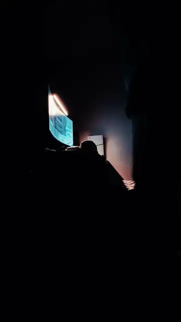
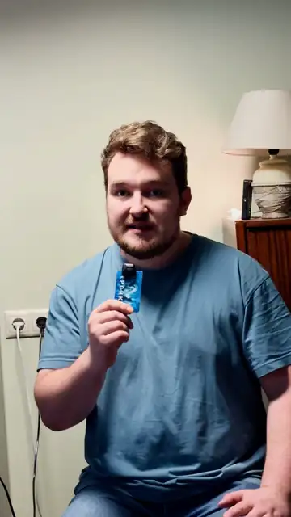
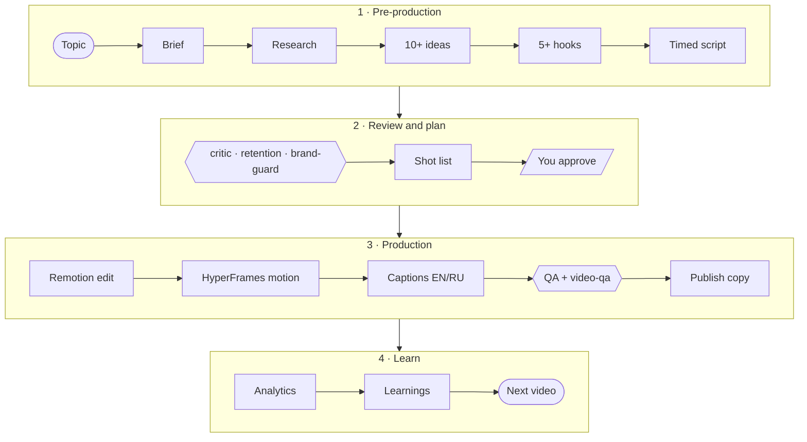

<div align="center">

# eda-marketing

**A short-form video marketing OS for Claude Code.**
Give it a topic — get back a researched, scripted, edited and QA-checked video package for TikTok, Reels and Shorts.
Facts stay true, captions stay readable, nothing ships without your approval.

[](LICENSE)
[](#install)
[](https://www.remotion.dev)
[](https://github.com/heygen-com/hyperframes)
[](#captions-that-respect-language)

</div>

---

## Made with eda-marketing

Two drafts the pipeline produced for the author's own projects: brief → ideas → hooks → script → review → shot list → Remotion edit → HyperFrames motion → captions → QA. They are **silent animatics** — estimated caption timing, no voice-over, no music — exactly what you get before you record yourself.

<table>
  <tr>
    <td align="center" width="50%">
      <a href="https://github.com/usredanchenko/eda-marketing/releases/download/v0.1.0/showcase-devlog.mp4"></a><br>
      <b>Dev diary</b> · 29 s · <code>DevDiary</code><br>
      <sub>Diegetic notification card (HyperFrames), honesty labels on work-in-progress visuals, accents that never duplicate captions.</sub><br>
      <a href="https://github.com/usredanchenko/eda-marketing/releases/download/v0.1.0/showcase-devlog.mp4">▶ watch mp4</a>
    </td>
    <td align="center" width="50%">
      <a href="https://github.com/usredanchenko/eda-marketing/releases/download/v0.1.0/showcase-founder-story.mp4"></a><br>
      <b>Founder story</b> · 30 s · <code>FounderStory</code><br>
      <sub>Real UI in test mode with redaction masks, message bubbles, a bubble transition (HyperFrames), stacked captions.</sub><br>
      <a href="https://github.com/usredanchenko/eda-marketing/releases/download/v0.1.0/showcase-founder-story.mp4">▶ watch mp4</a>
    </td>
  </tr>
</table>

<sub>Showcase captions are in Russian (the <code>ru</code> language pack). The videos, the people, products and brands in them are © the author, all rights reserved — see <a href="LICENSE-MEDIA.md">LICENSE-MEDIA.md</a>. The code is MIT.</sub>

---

## What it does



- **One command, the whole pipeline.** `/eda-marketing:marketing video <brand> "<topic>"` walks the stages in `quick`, `standard`, `production` or `deep` mode and stops at every decision that is yours.
- **Brand-safe by construction.** Every product claim must resolve to `facts.yaml` with a status — `PUBLIC_CONFIRMED`, `INTERNAL`, `NEEDS_CONFIRMATION`, `FORBIDDEN`. Unknown facts become `[CONFIRM: …]`, never inventions. Metrics on screen need a confirmed fact; mockups need an honesty label.
- **Craft, not templates.** Hooks must pay off inside the video. Scripts are timed blocks (Visual · Speech · Text · Sound · Motion) checked against your real speaking rate. Cuts land on thought boundaries; pauses survive.
- **Real editing stack.** One generic Remotion `SceneTimeline` renders 13 presets from plain JSON props; HyperFrames builds transparent motion segments only where a motion brief asks for them.
- **Captions that respect language.** Negations never split from their verb, prepositions stay with their noun, numbers keep their units — in English and Russian. Line breaks are measured with the real font files.
- **QA you can trust.** Resolution, fps, duration, decode errors, EBU R128 loudness and true peak, silence, black/frozen frames, missing fonts and assets, caption overflow, safe areas, on-screen claim lint, contact sheet — plus a visual review agent. And it tells you honestly what it did **not** check (for example, nobody listened to the audio).
- **A loop, not a one-off.** Import platform CSVs (unknown = `null`, never `0`), get findings with confidence levels by sample size, log experiments, and let `next` suggest the following video without repeating yourself.

## Install

You need **Node ≥ 22**, **git**, **FFmpeg** (with VP9/`libvpx`) and about **2 GB** of disk. macOS and Linux are supported; on Windows use WSL or `claude --plugin-dir ./plugin`.

### Option A — workspace (recommended)

```bash
git clone https://github.com/usredanchenko/eda-marketing.git
```

```bash
cd eda-marketing && bash scripts/bootstrap.sh
```

```bash
claude
```

Inside Claude Code the plugin loads from `.claude/skills/eda-marketing`. Start with:

```
/eda-marketing:marketing brand new
```

### Option B — plugin from the marketplace

```
/plugin marketplace add usredanchenko/eda-marketing
/plugin install eda-marketing@eda-marketing
/eda-marketing:marketing setup
```

`setup` asks before it clones the workspace and installs dependencies (it needs a place for the engine, renders and your brand kit).

## Quick start

The repo ships a fictional brand, **Acme Focus**, so everything works before you add your own:

```bash
npm run mos -- brand show acme-focus
```

```bash
npm run studio
```

Then open the example package and the 16 template fixtures in Remotion Studio at `http://localhost:3100`. In Claude Code:

```
/eda-marketing:marketing video acme-focus "why one timer beats a growing to-do list" standard
```

You get **IDEA · HOOK · SHOT LIST · SCRIPT · EDIT · MOTION · CAPTION · CTA**, links to the package files, and a list of what still needs confirmation — then it waits for your "yes" before production.

## Commands

| Command | What happens |
|---|---|
| `/eda-marketing:marketing setup [dir]` | Create a workspace (asks first) |
| `/eda-marketing:marketing brand new` | One-block interview → brand kit, `facts.yaml`, `brand.json`, `tokens.json` |
| `/eda-marketing:marketing video <brand> "<topic>" [mode]` | The full package; in `production` also the edit, motion, captions and a draft render |
| `/eda-marketing:marketing research <brand> ["topic"]` | Trends and discussions, labeled FACT / OBSERVATION / HYPOTHESIS |
| `/eda-marketing:marketing ideas <brand> ["topic"]` | 10+ scored ideas, duplicates flagged, top 3 with reasons |
| `/eda-marketing:marketing next <brand>` | What to film next: memory + analytics + open experiments |
| `/eda-marketing:marketing review <video.mp4>` | Critique of a finished video |
| `/eda-marketing:marketing analytics import <file.csv>` | Platform export → records (dry run first) |
| `/eda-marketing:marketing reference add <URL>` | A reference video → an abstract pattern, never a copy |
| `/eda-marketing:marketing status` | Packages, stages and pending gates |

| Mode | Runs |
|---|---|
| `quick` | ≤3 questions → duplicate check → 5 hooks → script → self-review → brand-guard |
| `standard` | + research, 10+ scored ideas, critic & retention agents, shot list, captions, publish copy |
| `production` | + footage ingest, edit/motion/sound plans, Remotion props, HyperFrames segments, Studio check, QA, draft render |
| `deep` | + reference analysis, 2–3 script variants, review loop, final render after approval |

The deterministic work lives in the `mos` engine — run `npm run mos -- --help` for `brand`, `new`, `ideas`, `script`, `captions`, `motion`, `video`, `qa`, `analytics`, `memory`, `reference`, `assets` and more.

## Skills and agents

**Skills** (generate, inline): `marketing` (orchestrator) · `trend-scout` · `idea-generator` · `hook-lab` · `script-writer` · `script-critic` · `retention-editor` · `shot-planner` · `editor` · `motion-designer` · `caption-writer` · `content-repurposer` · `footage-ingest` · `video-qa` · `analytics-review` · `reference`

**Agents** (review, read-only, run in parallel): `researcher` · `brand-guard` · `script-critic` · `retention-editor` · `reference-analyst` · `video-qa` · `analytics-analyst`

Generators never grade their own work: critique runs in separate subagents that only read files and return findings. Details: [docs/SKILLS.md](docs/SKILLS.md).

## Your brand kit

```
brands/<brand-id>/
  BRAND.md  AUDIENCE.md  POSITIONING.md  CONTENT_PILLARS.md
  TONE_OF_VOICE.md  FORBIDDEN_CLAIMS.md  MOTION_LANGUAGE.md
  facts.yaml      # every claim, with status and source → PRODUCT_FACTS.md is generated
  brand.json      # language, defaults, speaking rate, CTA, hashtags, research themes, idea weights
  tokens.json     # color roles, gradients, fonts (with licenses), type scale, motion, caption styles
```

Create one with `npm run mos -- brand new <id> --name "Name" --language en` or the guided interview. Brands are discovered automatically and never mix. See [docs/BRANDS.md](docs/BRANDS.md).

## Captions that respect language

| | English pack | Russian pack |
|---|---|---|
| Kept together | articles, prepositions, `not`/`can't` + verb, possessives, number + unit, names, protected phrases | `не`/`ни`, prepositions, particles `бы/же/ли`, number + unit, protected phrases |
| Timing before recording | syllables per second (vowel groups, silent *e*) | syllables per second (vowels) |
| Typography | non-breaking glue for short words, no dangling last word | the same, Russian short words and dashes |
| Modes | `replace` · `accumulate` · `highlight` | same |

After you record, `captions transcribe` runs **local** faster-whisper (installed only with your permission), raw ASR stays immutable, fixes go to `corrected.*`, and the SRT always contains every spoken word — but never the editorial CTA.

## Safety gates

Nothing below happens without your explicit "yes", recorded verbatim in the package `manifest.json`:

publishing · final render · production start · motion segments · paid APIs · model or media downloads · touching `input/` (raw footage is read-only) · `git push`.

Secrets live only in `.env`; the doctor shows whether a key is set, never its value. Web pages, files and agent output are treated as data, not instructions. Rendering stops if a brand font fails to load — no silent fallback fonts in your videos.

## Repository layout

```
.claude-plugin/        marketplace manifest
plugin/                the Claude Code plugin: skills/, agents/, scripts/setup-workspace.sh
packages/core/         zod schemas, caption engine, language packs, layout (no fs — bundled by Remotion)
engine/                `mos` CLI: packages, checks, captions, video, motion, QA, analytics, memory
video/remotion/        SceneTimeline, 13 presets, components, fixtures
video/hyperframes/     motion templates: notification-card, bubble-transition
brands/                _template + acme-focus (fictional example)
config/                platforms & safe areas, analytics, banned phrases per language
workflows/             modes, stages, package document templates
content/               one folder per video package
docs/                  architecture, workflows, skills, brands, video pipeline, analytics, editorial rules
```

## Checks

```bash
npm run check
```

`check` = types + ESLint + vitest + `mos validate --all`. Also: `npm run test:remotion` (every composition renders a non-blank still), `npm run test:hf` (HyperFrames check + alpha channel), `npm run test:render` (partial render + QA). Passing checks prove the code, not the edit — always look at Studio and the frames.

## Docs

[Architecture](docs/ARCHITECTURE.md) · [Workflows](docs/WORKFLOWS.md) · [Skills](docs/SKILLS.md) · [Brands](docs/BRANDS.md) · [Video pipeline](docs/VIDEO_PIPELINE.md) · [Analytics](docs/ANALYTICS.md) · [Editorial rules](docs/EDITORIAL_RULES.md) · [Glossary](docs/GLOSSARY.md) · [Agent rules](CLAUDE.md)

## License

- Code, skills, agents, workflows and docs: **MIT** — [LICENSE](LICENSE).
- Showcase videos and previews: **all rights reserved** — [LICENSE-MEDIA.md](LICENSE-MEDIA.md).
- Third-party components keep their licenses — [THIRD_PARTY_NOTICES.md](THIRD_PARTY_NOTICES.md). Note that **Remotion** requires a company license for for-profit organizations with more than three employees.
- Optional community skills: [THIRD_PARTY_SKILLS.md](THIRD_PARTY_SKILLS.md).
